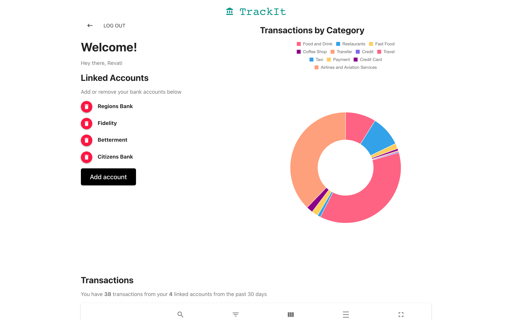

# Trackit

Trackit is a webapp that allows users to access and manage all their financial data at one place.

## Table of Contents

- [Overview](#overview)
- [Demo](#demo)
- [Installation](#installation)
- [Usage](#usage)
- [Screenshots](#screenshots)
- [License](#license)

## Overview

Trackit is a personal finance management app that I designed and developed using React and Redux for state management. As a developer, I have always been curious about exploring finance APIs, and my research led me to discover Plaid. With Trackit, users can link their multiple accounts all in one place and view an interactive chart of their category-wise expenses. They can also view their account summary, all at one place. I used Plaid (sandbox mode only) for data, MongoDB to persist the user's account activity data, JWT for authentication, and Chart.js to display beautiful charts based on users' financial data categories. This MERN app has been deployed on AWS Elastic Beanstalk. Trackit is a great tool for anyone looking for a simple and effective way to manage their personal finances.

## Demo

https://trackit-personal-finance.vercel.app/

## Installation

- Clone the project into your local directory.
- npm install to install the server side dependencies.
- cd client & npm install to install the client side dependencies.
- create a .env file in the root and populate it with values as shown in .envExample file.
- npm run server to start the backend.
- In the client directory , npm run dev to start the client. 

## Usage
1. User Registers to create an account. 
2. Upon successful login, users will see a link to connect to their bank account. As this uses plaid API in sandbox mode, users can choose any account for demo purpose.
3. Enter the following credentials : username : user_good , password: pass_good for any account. Enter 1234 for verification code.
4. Users can connect as many accounts as they want to monitor at one place. The expenses sorted categories wise will be available to view in a table format as well as a descriptive, interactive pie chart. 

 
Trackit is a great tool for anyone who wants to manage all their accounts at one place.

## Screenshots

## License

This project is licensed under the ISC license.

